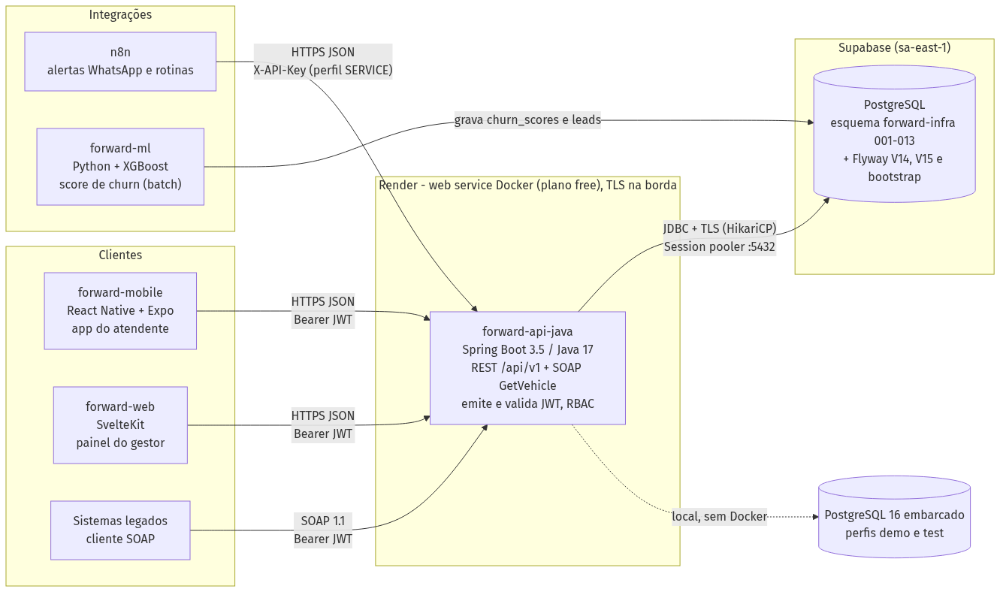
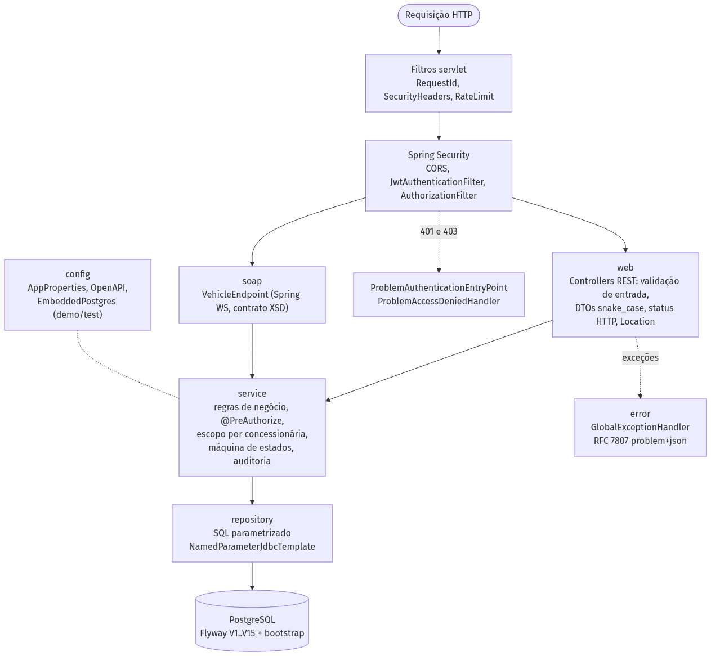
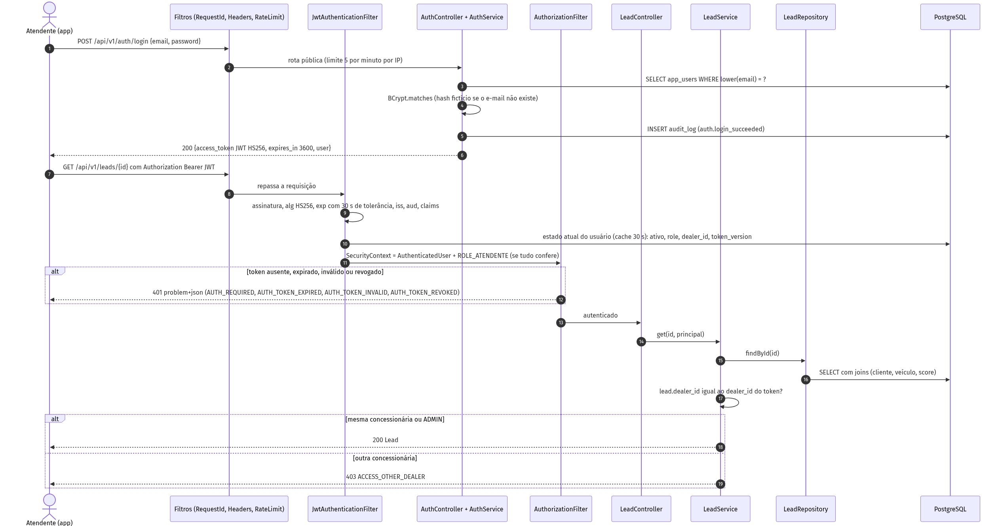
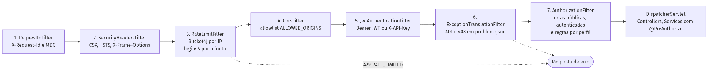

# Arquitetura Orientada a Serviços e Web Services: Entrega Sprint 3

**Challenge Ford × FIAP 2026 · ForwardService (Desafio 02, VIN Share)** · Turma 3ESPZ · Prof. Salatiel Luz Marinho · Entrega em 27/09/2026

| Integrante | RM |
|---|---|
| João Victor Franco | 556790 |
| Lucca Saraiva Borges | 554608 |
| Ruan Melo Vieira | 557599 |
| Rodrigo César Jimenez | 558148 |
| Bruno Leão | 555563 |

## Links da entrega

| Item | Link |
|---|---|
| Repositório da API | https://github.com/fwd-ford/forward-api-java |
| README (como executar, perfis, endpoints) | https://github.com/fwd-ford/forward-api-java#readme |
| Arquitetura (diagramas e fluxos) | https://github.com/fwd-ford/forward-api-java/blob/main/docs/ARQUITETURA.md |
| Contrato OpenAPI 3 | https://github.com/fwd-ford/forward-api-java/blob/main/openapi.yaml |
| Swagger UI (local) | http://localhost:8080/swagger-ui/index.html |
| API publicada (Render) | https://forward-api-java.onrender.com/swagger-ui/index.html |
| Coleção Postman (38 requisições) | https://github.com/fwd-ford/forward-api-java/blob/main/docs/ForwardService.postman_collection.json |
| Evidências dos testes | https://github.com/fwd-ford/forward-api-java/tree/main/docs/evidencias |
| Pull request da entrega (código + revisão + CI) | https://github.com/fwd-ford/forward-api-java/pull/48 |

## Critérios da Sprint 3 e onde cada um é atendido

| Critério (peso) | O que foi feito | Evidência |
|---|---|---|
| **Arquitetura da solução (20%)** | Diagrama de componentes da solução (app, web, n8n, ML, API, PostgreSQL), camadas internas da API (controller → service → repository), fluxo de autenticação/autorização e cadeia de filtros. Responsabilidades separadas em pacotes `web`, `service`, `repository`, `security`, `error`, `soap` | `docs/ARQUITETURA.md`, `docs/img/*.png` (abaixo) |
| **Autenticação e autorização (20%)** | Spring Security stateless com filtro JWT próprio. Endpoints públicos (login, health, Swagger, WSDL) e protegidos (todo o resto). Perfis **ATENDENTE**, **GESTOR** e **ADMIN** aplicados por URL (`SecurityConfig`) e por método (`@PreAuthorize`), mais escopo por concessionária. Acesso revogado na hora quando o usuário é desativado, excluído, rebaixado ou muda de concessionária (401 `AUTH_TOKEN_REVOKED`). Respostas 401/403 em RFC 7807 | `security/SecurityConfig.java`, `service/*`, `SecurityIT` (23 testes), `TokenRevocationIT` (8) |
| **JWT (15%)** | Geração no `POST /api/v1/auth/login`. Token HS256 com `sub`, `role`, `dealer_id`, `name`, `email`, `token_version`, `iss`, `aud`, `iat`, `exp` (60 min, configurável) e `jti`. A validação confere assinatura, expiração (30 s de tolerância), emissor, audiência e, a cada requisição, o estado atual do usuário (ativo, perfil, concessionária e `token_version`). Sem segredo forte, a API não sobe em produção. As *claims* guiam a autorização | `security/JwtService.java`, `JwtServiceTest` (20), `AuthIT` (12) |
| **Maturidade REST nível 2 (20%)** | Recursos por URI e verbos com semântica HTTP (GET, POST, PUT, PATCH, DELETE). Códigos de status: 201 com `Location`, 204, 400, 401, 403, 404, 405, 409, 415, 422 e 429. Coleções com `X-Total-Count` e deprecação sinalizada por header | Tabela de endpoints abaixo; `LeadIT`, `ServiceEventIT`, `UserIT`, `ErrorHandlingIT` |
| **Testes automatizados (15%)** | **220 testes, 0 falhas** (121 unitários e 99 de integração HTTP contra PostgreSQL 16 embarcado). Cobrem sucesso, erro, acesso não autorizado (401/403) e revogação de tokens. Cobertura de linhas de **92,4%** (JaCoCo). A CI roda em todo PR | `docs/evidencias/testes-2026-09-27.txt`, `jacoco-resumo.md`, `surefire-report/` |
| **Documentação e erros (10%)** | OpenAPI 3 com esquema *bearer*, Swagger público, README em pt-BR com execução passo a passo, coleção Postman e erros padronizados RFC 7807 (`application/problem+json` com `code` e `request_id`) | `openapi.yaml`, README, `error/GlobalExceptionHandler.java` |

## Arquitetura









A forward-api-java é o único gateway da plataforma. O app mobile, o painel web e a automação (n8n) só acessam dados por ela. A API expõe REST (JSON) e SOAP (`GetVehicle`, contrato WSDL), emite e valida os tokens e aplica o perfil e a concessionária do usuário em todas as consultas. A persistência usa PostgreSQL com migrations Flyway: o perfil `demo` roda com o banco embarcado, e em produção o banco é o do Supabase.

## Autenticação passo a passo

```bash
# 1) login (público) -> JWT
curl -s -X POST http://localhost:8080/api/v1/auth/login \
  -H "Content-Type: application/json" \
  -d '{"email":"atendente@forward.dev","password":"Forward@2026"}'
# {"access_token":"eyJhbGciOiJIUzI1NiJ9.<payload>.<assinatura>","token_type":"Bearer",
#  "expires_in":3600,"user":{"role":"ATENDENTE","dealer_name":"Ford Morumbi São Paulo",...}}

# 2) recurso protegido com o token
curl -s http://localhost:8080/api/v1/leads -H "Authorization: Bearer <access_token>"

# 3) sem token -> 401; perfil sem permissão -> 403 (problem+json)
curl -s -i http://localhost:8080/api/v1/users -H "Authorization: Bearer <token_do_atendente>"
```

Usuários de demonstração (senha `Forward@2026`): `gestor@forward.dev` (GESTOR), `atendente@forward.dev` e `atendente2@forward.dev` (ATENDENTE de concessionárias diferentes); `admin@forward.dev` (ADMIN, todas as concessionárias) existe no perfil `demo` com a mesma senha e, em produção, só é criado com a senha definida em `ADMIN_BOOTSTRAP_PASSWORD`.

## Perfis e permissões

| Recurso | ATENDENTE | GESTOR | ADMIN |
|---|---|---|---|
| `POST /api/v1/auth/login` | público | público | público |
| `GET /api/v1/me` | sim | sim | sim |
| Leads: listar, detalhar, `PATCH` | própria concessionária | própria concessionária | todas |
| Clientes, score, veículos, SOAP `GetVehicle` | própria concessionária | própria concessionária | todas |
| Eventos de serviço: `POST`/`PUT` | 403 | própria concessionária | todas |
| Eventos de serviço: `DELETE` | 403 | 403 | sim |
| Usuários (`/api/v1/users`) | 403 | 403 | sim |

Recurso de outra concessionária: **403 `ACCESS_OTHER_DEALER`**. Perfil sem permissão: **403 `ACCESS_DENIED`**.

## Endpoints REST (nível 2)

| Método | Caminho | Perfis | Sucesso | Erros |
|---|---|---|---|---|
| POST | `/api/v1/auth/login` | público | 200 | 400, 401, 415, 429 |
| GET | `/api/v1/me` | todos | 200 | 401 |
| GET | `/api/v1/leads` | todos (escopo) | 200 + `X-Total-Count` | 400, 403 |
| GET | `/api/v1/leads/{id}` | todos (escopo) | 200 | 400, 403, 404 |
| PATCH | `/api/v1/leads/{id}` | todos (escopo) | 200 | 400, 403, 404, 409, 415 |
| GET | `/api/v1/customers/{id}` e `/{id}/score` | todos (escopo) | 200 | 400, 403, 404 |
| GET | `/api/v1/vehicles/{vin}` | todos (escopo) | 200 | 400, 403, 404 |
| GET | `/api/v1/service-events` e `/{id}` | todos (escopo) | 200 | 400, 403, 404 |
| POST | `/api/v1/service-events` | GESTOR, ADMIN | 201 + `Location` | 400, 403, 409, 415, 422 |
| PUT | `/api/v1/service-events/{id}` | GESTOR, ADMIN | 200 | 400, 403, 404, 409, 422 |
| DELETE | `/api/v1/service-events/{id}` | ADMIN | 204 | 403, 404 |
| GET/POST | `/api/v1/users` | ADMIN | 200 / 201 + `Location` | 400, 403, 409, 422 |
| PATCH/DELETE | `/api/v1/users/{id}` | ADMIN | 200 / 204 | 400, 403, 404, 409 |
| GET | `/soap/vehicles.wsdl` · POST `/soap/vehicles` | público · todos | 200 | 401, SOAP Fault |

Máquina de estados do lead: `new → assigned | contacted | lost`, `assigned → contacted | lost`, `contacted → converted | lost`. Estados finais respondem **409 `LEAD_INVALID_TRANSITION`**.

## Formato de erro (RFC 7807)

```json
{
  "type": "urn:forward:problem:auth-invalid-credentials",
  "title": "Não autenticado",
  "status": 401,
  "detail": "E-mail ou senha inválidos.",
  "instance": "/api/v1/auth/login",
  "code": "AUTH_INVALID_CREDENTIALS",
  "timestamp": "2026-09-27T07:51:14Z",
  "request_id": "df74dbcc-9e36-4e53-8975-2de6233e3fe2"
}
```

## Testes automatizados e evidências

Comando: `./mvnw -B -ntp clean verify -P quality`. Resultado: **220 testes, 0 falhas, 0 erros**, Checkstyle sem violações, SpotBugs e FindSecBugs sem achados, BUILD SUCCESS.

| Suíte | Tipo | Testes | O que cobre |
|---|---|---|---|
| `SecurityIT` | integração HTTP | 23 | Sem token, token expirado, assinatura/emissor/audiência inválidos (401); perfil e concessionária (403); rotas públicas |
| `JwtServiceTest` | unitário | 20 | Emissão e validação, expiração, adulteração, claims obrigatórias (incl. `token_version`), segredo fraco |
| `LeadIT` | integração HTTP | 16 | Escopo, 200/404, PATCH, transição inválida (409), status inválido (400) |
| `AuthIT` | integração HTTP | 12 | Login 200, senha errada ou usuário inexistente (401 idêntico), desativado, 400, rate limit |
| `UserIT` | integração HTTP | 11 | CRUD admin: 201 + Location, duplicado (409), 204, auto-exclusão (409) |
| `ServiceEventIT` | integração HTTP | 10 | POST 201 → GET → PUT → DELETE 204 → 404; 422 |
| `ErrorHandlingIT` | integração HTTP | 9 | 405, 415, JSON malformado: tudo em `problem+json` |
| `TokenRevocationIT` | integração HTTP | 8 | Token antigo recusado (401 `AUTH_TOKEN_REVOKED`) logo após desativar, rebaixar ADMIN para GESTOR, mover de concessionária, redefinir senha ou excluir o usuário |
| Demais (12 suítes) | unitário/integração | 111 | Serviços, validações, filtros, cache de revogação (TTL), SOAP (XXE bloqueado), sanitização de log, migração de produção |

Cobertura (JaCoCo): **92,4% das linhas** e 76,1% dos branches no total; `security` 94,9%, `service` 96,4% e `web` 98,4% das linhas.

**Validação de ponta a ponta:** o APK Android (forward-mobile) foi testado contra esta API: login JWT, listagem restrita à concessionária, `PATCH` de status persistido e perfil exibindo o papel do token.

## Como executar

```bash
# sem Docker e sem banco externo (PostgreSQL embarcado + dados de demonstração)
./mvnw spring-boot:run -Dspring-boot.run.profiles=demo
# Windows: .\mvnw.cmd spring-boot:run "-Dspring-boot.run.profiles=demo"
# Swagger: http://localhost:8080/swagger-ui/index.html

# testes + relatórios (target/site/jacoco, target/reports/surefire.html)
./mvnw -B -ntp clean verify -P quality
```

Em produção, a API roda no Render (Blueprint `render.yaml`, imagem Docker) com o PostgreSQL do Supabase. O Flyway aplica o *baseline* do schema existente e o `JWT_SECRET` é gerado pelo provedor.
